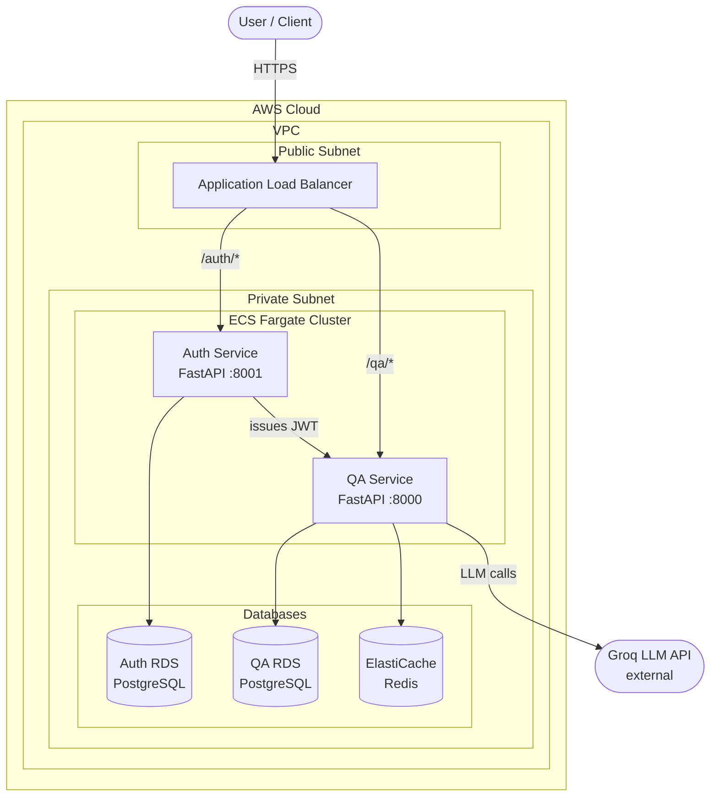

# AI-Powered Q&A Microservice

A production-grade, cloud-native AI Q&A system built with microservices architecture, deployed on AWS ECS Fargate using Terraform and GitHub Actions CI/CD.

## Architecture


## Tech Stack

| Layer | Technology |
|---|---|
| Backend | FastAPI (Python) |
| LLM | Groq API (Llama 3) |
| Auth | JWT + bcrypt |
| Database | PostgreSQL (AWS RDS) |
| Cache | Redis (AWS ElastiCache) |
| Containers | Docker + Docker Compose |
| CI/CD | GitHub Actions |
| Infrastructure | Terraform |
| Cloud | AWS ECS Fargate, ECR, VPC, ALB |

## Services

### Auth Service (Port 8001)
Handles user registration, login, and JWT token generation.

| Endpoint | Method | Description |
|---|---|---|
| `/health` | GET | Health check |
| `/auth/signup` | POST | Register a new user |
| `/auth/login` | POST | Login and receive JWT token |

### QA Service (Port 8000)
Accepts questions, queries the Groq LLM, caches responses in Redis, and stores history in Postgres.

| Endpoint | Method | Auth | Description |
|---|---|---|---|
| `/health` | GET | No | Health check |
| `/qa/ask` | POST | Yes | Ask a question |
| `/qa/history` | GET | Yes | Get question history |

## Local Development

### Prerequisites
- Python 3.11+
- Docker Desktop
- Git

### Running with Docker Compose

```bash
# Clone the repo
git clone https://github.com/vivekladhe37/ai-qa-microservice.git
cd ai-qa-microservice

# Create root .env file
cp .env.example .env
# Fill in your values in .env

# Start all services
docker-compose up --build
```

Services will be available at:
- Auth Service: `http://localhost:8001/docs`
- QA Service: `http://localhost:8000/docs`

### Running Services Individually

```bash
# Auth Service
cd backend/auth_service
python -m venv venv
venv\Scripts\activate
pip install -r requirements.txt
uvicorn main:app --reload --port 8001

# QA Service
cd backend/qa_service
python -m venv venv
venv\Scripts\activate
pip install -r requirements.txt
uvicorn main:app --reload --port 8000
```

### Running Tests

```bash
# Auth Service
cd backend/auth_service
pytest tests/ -v

# QA Service
cd backend/qa_service
pytest tests/ -v
```

## Infrastructure

All infrastructure is managed with Terraform.

```bash
cd infra/terraform

# Initialize
terraform init

# Preview changes
terraform plan

# Deploy
terraform apply

# Destroy
terraform destroy
```

### AWS Resources Created
- VPC with public and private subnets across 2 availability zones
- ECS Fargate cluster with 2 services
- RDS PostgreSQL (2 instances — auth and qa)
- ElastiCache Redis
- Application Load Balancer with path-based routing
- ECR repositories for Docker images
- IAM roles with least-privilege policies
- CloudWatch log groups

## CI/CD Pipeline

GitHub Actions pipeline triggers on every push to `develop`:

1. Run tests for both services in parallel
2. Build Docker images
3. Push to AWS ECR
4. Deploy to ECS with rolling updates

## Environment Variables

Copy `.env.example` to `.env` and fill in the values:

```bash
# Database
DB_USER=your_db_user
DB_PASSWORD=your_db_password

# Secrets
GROQ_API_KEY=your_groq_api_key
JWT_SECRET_KEY=your_jwt_secret_key
```

## Project Structure

```
ai-qa-microservice/
├── backend/
│   ├── auth_service/     # JWT auth microservice
│   └── qa_service/       # LLM Q&A microservice
├── infra/
│   └── terraform/        # AWS infrastructure
├── k8s/
│   └── manifests/        # Kubernetes manifests (future)
├── .github/
│   └── workflows/        # GitHub Actions CI/CD
└── docker-compose.yml    # Local development
```

## License

MIT
# AI-Powered Q&A Microservice

A production-grade, cloud-native AI Q&A system built with microservices architecture, deployed on AWS ECS Fargate using Terraform and GitHub Actions CI/CD.

## Architecture


## Tech Stack

| Layer | Technology |
|---|---|
| Backend | FastAPI (Python) |
| LLM | Groq API (Llama 3) |
| Auth | JWT + bcrypt |
| Database | PostgreSQL (AWS RDS) |
| Cache | Redis (AWS ElastiCache) |
| Containers | Docker + Docker Compose |
| CI/CD | GitHub Actions |
| Infrastructure | Terraform |
| Cloud | AWS ECS Fargate, ECR, VPC, ALB |

## Services

### Auth Service (Port 8001)
Handles user registration, login, and JWT token generation.

| Endpoint | Method | Description |
|---|---|---|
| `/health` | GET | Health check |
| `/auth/signup` | POST | Register a new user |
| `/auth/login` | POST | Login and receive JWT token |

### QA Service (Port 8000)
Accepts questions, queries the Groq LLM, caches responses in Redis, and stores history in Postgres.

| Endpoint | Method | Auth | Description |
|---|---|---|---|
| `/health` | GET | No | Health check |
| `/qa/ask` | POST | Yes | Ask a question |
| `/qa/history` | GET | Yes | Get question history |

## Local Development

### Prerequisites
- Python 3.11+
- Docker Desktop
- Git

### Running with Docker Compose

```bash
# Clone the repo
git clone https://github.com/vivekladhe37/ai-qa-microservice.git
cd ai-qa-microservice

# Create root .env file
cp .env.example .env
# Fill in your values in .env

# Start all services
docker-compose up --build
```

Services will be available at:
- Auth Service: `http://localhost:8001/docs`
- QA Service: `http://localhost:8000/docs`

### Running Services Individually

```bash
# Auth Service
cd backend/auth_service
python -m venv venv
venv\Scripts\activate
pip install -r requirements.txt
uvicorn main:app --reload --port 8001

# QA Service
cd backend/qa_service
python -m venv venv
venv\Scripts\activate
pip install -r requirements.txt
uvicorn main:app --reload --port 8000
```

### Running Tests

```bash
# Auth Service
cd backend/auth_service
pytest tests/ -v

# QA Service
cd backend/qa_service
pytest tests/ -v
```

## Infrastructure

All infrastructure is managed with Terraform.

```bash
cd infra/terraform

# Initialize
terraform init

# Preview changes
terraform plan

# Deploy
terraform apply

# Destroy
terraform destroy
```

### AWS Resources Created
- VPC with public and private subnets across 2 availability zones
- ECS Fargate cluster with 2 services
- RDS PostgreSQL (2 instances — auth and qa)
- ElastiCache Redis
- Application Load Balancer with path-based routing
- ECR repositories for Docker images
- IAM roles with least-privilege policies
- CloudWatch log groups

## CI/CD Pipeline

GitHub Actions pipeline triggers on every push to `develop`:

1. Run tests for both services in parallel
2. Build Docker images
3. Push to AWS ECR
4. Deploy to ECS with rolling updates

## Environment Variables

Copy `.env.example` to `.env` and fill in the values:

```bash
# Database
DB_USER=your_db_user
DB_PASSWORD=your_db_password

# Secrets
GROQ_API_KEY=your_groq_api_key
JWT_SECRET_KEY=your_jwt_secret_key
```

## Project Structure

```
ai-qa-microservice/
├── backend/
│   ├── auth_service/     # JWT auth microservice
│   └── qa_service/       # LLM Q&A microservice
├── infra/
│   └── terraform/        # AWS infrastructure
├── k8s/
│   └── manifests/        # Kubernetes manifests
├── .github/
│   └── workflows/        # GitHub Actions CI/CD
└── docker-compose.yml    # Local development
```

## License

MIT
# AI-Powered Q&A Microservice

A production-grade, cloud-native AI Q&A system built with microservices architecture, deployed on AWS ECS Fargate using Terraform and GitHub Actions CI/CD.

## Architecture



## Tech Stack

| Layer | Technology |
|---|---|
| Backend | FastAPI (Python) |
| LLM | Groq API (Llama 3) |
| Auth | JWT + bcrypt |
| Database | PostgreSQL (AWS RDS) |
| Cache | Redis (AWS ElastiCache) |
| Containers | Docker + Docker Compose |
| CI/CD | GitHub Actions |
| Infrastructure | Terraform |
| Cloud | AWS ECS Fargate, ECR, VPC, ALB |

## Services

### Auth Service (Port 8001)
Handles user registration, login, and JWT token generation.

| Endpoint | Method | Description |
|---|---|---|
| `/health` | GET | Health check |
| `/auth/signup` | POST | Register a new user |
| `/auth/login` | POST | Login and receive JWT token |

### QA Service (Port 8000)
Accepts questions, queries the Groq LLM, caches responses in Redis, and stores history in Postgres.

| Endpoint | Method | Auth | Description |
|---|---|---|---|
| `/health` | GET | No | Health check |
| `/qa/ask` | POST | Yes | Ask a question |
| `/qa/history` | GET | Yes | Get question history |

## Local Development

### Prerequisites
- Python 3.11+
- Docker Desktop
- Git

### Running with Docker Compose

```bash
# Clone the repo
git clone https://github.com/vivekladhe37/ai-qa-microservice.git
cd ai-qa-microservice

# Create root .env file
cp .env.example .env
# Fill in your values in .env

# Start all services
docker-compose up --build
```

Services will be available at:
- Auth Service: `http://localhost:8001/docs`
- QA Service: `http://localhost:8000/docs`

### Running Services Individually

```bash
# Auth Service
cd backend/auth_service
python -m venv venv
venv\Scripts\activate
pip install -r requirements.txt
uvicorn main:app --reload --port 8001

# QA Service
cd backend/qa_service
python -m venv venv
venv\Scripts\activate
pip install -r requirements.txt
uvicorn main:app --reload --port 8000
```

### Running Tests

```bash
# Auth Service
cd backend/auth_service
pytest tests/ -v

# QA Service
cd backend/qa_service
pytest tests/ -v
```

## Infrastructure

All infrastructure is managed with Terraform.

```bash
cd infra/terraform

# Initialize
terraform init

# Preview changes
terraform plan

# Deploy
terraform apply

# Destroy
terraform destroy
```

### AWS Resources Created
- VPC with public and private subnets across 2 availability zones
- ECS Fargate cluster with 2 services
- RDS PostgreSQL (2 instances — auth and qa)
- ElastiCache Redis
- Application Load Balancer with path-based routing
- ECR repositories for Docker images
- IAM roles with least-privilege policies
- CloudWatch log groups

## CI/CD Pipeline

GitHub Actions pipeline triggers on every push to `develop`:

1. Run tests for both services in parallel
2. Build Docker images
3. Push to AWS ECR
4. Deploy to ECS with rolling updates

## Environment Variables

Copy `.env.example` to `.env` and fill in the values:

```bash
# Database
DB_USER=your_db_user
DB_PASSWORD=your_db_password

# Secrets
GROQ_API_KEY=your_groq_api_key
JWT_SECRET_KEY=your_jwt_secret_key
```

## Project Structure

```
ai-qa-microservice/
├── backend/
│   ├── auth_service/     # JWT auth microservice
│   └── qa_service/       # LLM Q&A microservice
├── infra/
│   └── terraform/        # AWS infrastructure
├── k8s/
│   └── manifests/        # Kubernetes manifests
├── .github/
│   └── workflows/        # GitHub Actions CI/CD
└── docker-compose.yml    # Local development
```

## License

MIT
# AI-Powered Q&A Microservice

A production-grade, cloud-native AI Q&A system built with microservices architecture, deployed on AWS ECS Fargate using Terraform and GitHub Actions CI/CD.

## Architecture


## Tech Stack

| Layer | Technology |
|---|---|
| Backend | FastAPI (Python) |
| LLM | Groq API (Llama 3) |
| Auth | JWT + bcrypt |
| Database | PostgreSQL (AWS RDS) |
| Cache | Redis (AWS ElastiCache) |
| Containers | Docker + Docker Compose |
| CI/CD | GitHub Actions |
| Infrastructure | Terraform |
| Cloud | AWS ECS Fargate, ECR, VPC, ALB |

## Services

### Auth Service (Port 8001)
Handles user registration, login, and JWT token generation.

| Endpoint | Method | Description |
|---|---|---|
| `/health` | GET | Health check |
| `/auth/signup` | POST | Register a new user |
| `/auth/login` | POST | Login and receive JWT token |

### QA Service (Port 8000)
Accepts questions, queries the Groq LLM, caches responses in Redis, and stores history in Postgres.

| Endpoint | Method | Auth | Description |
|---|---|---|---|
| `/health` | GET | No | Health check |
| `/qa/ask` | POST | Yes | Ask a question |
| `/qa/history` | GET | Yes | Get question history |

## Local Development

### Prerequisites
- Python 3.11+
- Docker Desktop
- Git

### Running with Docker Compose

```bash
# Clone the repo
git clone https://github.com/vivekladhe37/ai-qa-microservice.git
cd ai-qa-microservice

# Create root .env file
cp .env.example .env
# Fill in your values in .env

# Start all services
docker-compose up --build
```

Services will be available at:
- Auth Service: `http://localhost:8001/docs`
- QA Service: `http://localhost:8000/docs`

### Running Services Individually

```bash
# Auth Service
cd backend/auth_service
python -m venv venv
venv\Scripts\activate
pip install -r requirements.txt
uvicorn main:app --reload --port 8001

# QA Service
cd backend/qa_service
python -m venv venv
venv\Scripts\activate
pip install -r requirements.txt
uvicorn main:app --reload --port 8000
```

### Running Tests

```bash
# Auth Service
cd backend/auth_service
pytest tests/ -v

# QA Service
cd backend/qa_service
pytest tests/ -v
```

## Infrastructure

All infrastructure is managed with Terraform.

```bash
cd infra/terraform

# Initialize
terraform init

# Preview changes
terraform plan

# Deploy
terraform apply

# Destroy
terraform destroy
```

### AWS Resources Created
- VPC with public and private subnets across 2 availability zones
- ECS Fargate cluster with 2 services
- RDS PostgreSQL (2 instances — auth and qa)
- ElastiCache Redis
- Application Load Balancer with path-based routing
- ECR repositories for Docker images
- IAM roles with least-privilege policies
- CloudWatch log groups

## CI/CD Pipeline

GitHub Actions pipeline triggers on every push to `develop`:

1. Run tests for both services in parallel
2. Build Docker images
3. Push to AWS ECR
4. Deploy to ECS with rolling updates

## Environment Variables

Copy `.env.example` to `.env` and fill in the values:

```bash
# Database
DB_USER=your_db_user
DB_PASSWORD=your_db_password

# Secrets
GROQ_API_KEY=your_groq_api_key
JWT_SECRET_KEY=your_jwt_secret_key
```

## Project Structure

```
ai-qa-microservice/
├── backend/
│   ├── auth_service/     # JWT auth microservice
│   └── qa_service/       # LLM Q&A microservice
├── infra/
│   └── terraform/        # AWS infrastructure
├── k8s/
│   └── manifests/        # Kubernetes manifests (future)
├── .github/
│   └── workflows/        # GitHub Actions CI/CD
└── docker-compose.yml    # Local development
```

## License

MIT
